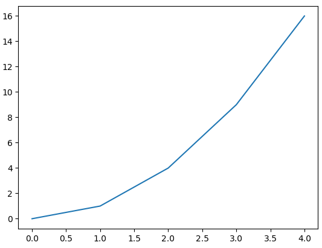
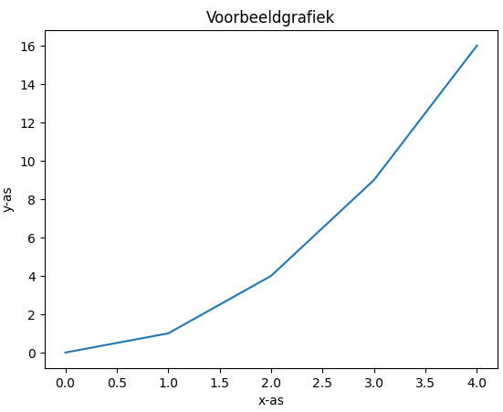
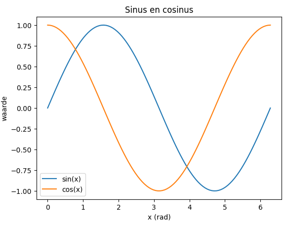
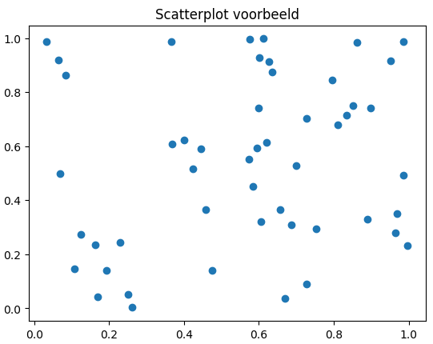
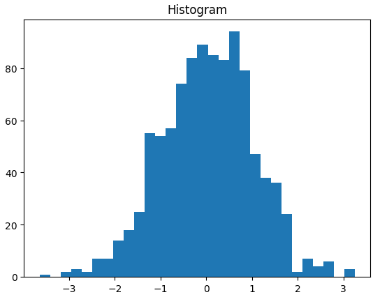

# Korte introductie tot Matplotlib

Matplotlib is een Python-bibliotheek waarmee je data kunt plotten (**grafieken tekenen**).

We gebruiken meestal het pyplot-gedeelte van Matplotlib, dat vaak wordt geïmporteerd als plt. Indien nodig, bekijk of herhaal de **[Introductie tot NumPy](Numpy.md)** om zeker te zijn dat je hier goed mee weg bent.

🔹 1. **Importeren**

```python 
import matplotlib.pyplot as plt
```

🔹 2. **Eenvoudige lijnplot**

```python 
import numpy as np
import matplotlib.pyplot as plt

x = np.array([0, 1, 2, 3, 4])
y = np.array([0, 1, 4, 9, 16])  # kwadraten

plt.plot(x, y)       # maak een lijnplot
plt.show()           # toon de grafiek
```
➡️ Dit tekent onderstaande grafiek: y = x².



🔹 3. **Labels en titel**

Zonder labels is een grafiek meestal betekenisloos. Op deze manier kan je ze toevoegen:

```python 
plt.plot(x, y)
plt.xlabel("x-as")
plt.ylabel("y-as")
plt.title("Voorbeeldgrafiek")
plt.show()
```
➡️ Dit tekent zelfde grafiek (y = x²) maar met namen voor grafiek, x-as en y-as.



🔹 4. **Meerdere reeksen in één grafiek**

```python 
# Maak een numpy array tussen 0 en 2 π met 100 punten
x = np.linspace(0, 2*np.pi, 100)  
plt.plot(x, np.sin(x), label="sin(x)")
plt.plot(x, np.cos(x), label="cos(x)")

plt.xlabel("x (rad)")
plt.ylabel("waarde")
plt.title("Sinus en cosinus")
plt.legend()       # legenda tonen
plt.show()
```


🔹 5. Stippen en lijntypes
```python 
plt.plot(x, np.sin(x), 'r--', label="sin(x)")  # rode stippellijn
plt.plot(x, np.cos(x), 'bo', label="cos(x)")   # blauwe bolletjes
plt.legend()
plt.show()
```

Enkele veelgebruikte stijlen:

- 'r--' → rode stippellijn
- 'g-' → groene lijn
- 'bo' → blauwe bolletjes

🔹 6. **Scatterplot** (*puntenwolk*)
```python 
x = np.random.rand(50)
y = np.random.rand(50)

plt.scatter(x, y)
plt.title("Scatterplot voorbeeld")
plt.show()
```


🔹 7. **Histogram**
```python 
data = np.random.normal(0, 1, 1000)  # 1000 getallen ~ normaal verdeeld
plt.hist(data, bins=30)
plt.title("Histogram")
plt.show()
```


🔹 8. **Hulplijnen**


### Horizontale en verticale lijnen door 0
```python 
plt.axhline(0, color='black', linewidth=1)   # x-as
plt.axvline(0, color='black', linewidth=1)   # y-as

plt.legend()
plt.show()
```

➡️ **plt.axhline()** tekent een *horizontale lijn*, **plt.axvline()** een *verticale lijn*.

### Extra hulplijnen op een specifieke waarde
```python 
plt.axhline(0.5, color='red', linestyle='--', label="y=0.5")
plt.axvline(np.pi, color='green', linestyle=':', label="x=π")

plt.legend()
plt.show()
```

➡️ linestyle='--' → streepjeslijn, ':' → stippellijn.

### Volledig raster

Je kunt ook een raster (grid) aanzetten:
```python 
plt.plot(x, np.sin(x), label="sin(x)")
plt.plot(x, np.cos(x), label="cos(x)")

plt.grid(True, linestyle='--', alpha=0.7)  # alpha = doorzichtigheid
plt.legend()
plt.show()
```

## Voorbeeld
```python 
# Importeer de numpy en matplotlib bibliotheek
import numpy as np
import matplotlib.pyplot as plt

# Maak een numpy array aan van 0 tot en met 2π met 100 punten
x = np.linspace(0, 2*np.pi, 100)  

# Maak een lijnplot van de sinus en de cosinus
plt.plot(x, np.sin(x), label="sin(x)")
plt.plot(x, np.cos(x), label="cos(x)")

# Maak zwarte hulplijnen op de x en y-as
plt.axhline(0, color='black', linewidth=1)   # x-as
plt.axvline(0, color='black', linewidth=1)   # y-as

# Maak een rode horizontale streepjeslijn op y = 0,5
plt.axhline(0.5, color='red', linestyle='--', label="y=0.5")

# Maak een groene vertikale strippelijn op x = π
plt.axvline(np.pi, color='green', linestyle=':', label="x=π")

# Maak een grid
plt.grid(True, linestyle='--', alpha=0.7)  # alpha = doorzichtigheid

# Maak een legende
plt.legend()

# Toon de grafiek
plt.show()
```
➡️ Het bovenstaande programma maakt deze grafiek


## Samenvatting

plt.plot() → lijngrafiek

plt.scatter() → puntenwolk

plt.hist() → histogram

plt.axhline(y, ...) → horizontale hulplijn

plt.axvline(x, ...) → verticale hulplijn

plt.grid(True) → raster aanzetten

Gebruik xlabel, ylabel, title, en legend voor duidelijke grafieken.

Vergeet niet altijd plt.show() te zetten om de grafiek zichtbaar te maken!