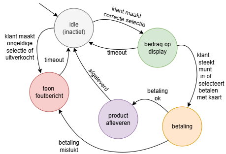

# Finite State Machine (FSM)

Een finite state machine (eindige toestandsmachine) is een model dat beschrijft hoe een systeem zich gedraagt afhankelijk van zijn huidige toestand (**state**). Het systeem kan van de ene toestand naar de andere gaan door gebeurtenissen (**events** of **inputs**). Dit wordt veel gebruikt in games, robots, automaten, enz.

## Grafische voorstelling

Hier bekijken we een grafische voorstelling van een automaat:
- De cirkels zijn de **toestanden** of **states**.
- De pijlen zijn de **gebeurtenissen** of **events**.



## Verkeerslicht 
Denk aan een **verkeerslicht**. Het kan in de **toestand** `groen`, `oranje` of `rood` zijn. Op basis van een *timer* of *knop* verandert het van toestand.

---

**Simpele Python-implementatie**

Hieronder een voorbeeld van een **FSM** voor een verkeerslicht, zonder klassen:

```python
state = "groen"

while True:
    print("Huidige toestand:", state)
    actie = input("Druk op Enter om naar de volgende toestand te gaan (of 'stop' om te stoppen): ")
    if actie == "stop":
        break
    if state == "groen":
        state = "oranje"
    elif state == "oranje":
        state = "rood"
    elif state == "rood":
        state = "groen"
```

**Uitleg:**  
- De variabele `state` houdt de huidige toestand bij.  
- Met een `while`-loop en `if/elif`-structuur bepaal je de volgende toestand.  
- Je kunt dit uitbreiden met meer toestanden en regels.

---

## Voorbeeld: FSM op de MBOT2 (CyberPi)

Hieronder zie je een FSM die werkt op de MBOT2-robot. De robot kan in verschillende toestanden zijn, zoals 'stop', 'line_follower' en 't_shape'. De toestand verandert door knoppen op de CyberPi of door sensorinput.

```python
import event, time, cyberpi, mbot2, mbuild
# initialize variables in global space
state = "stop"
previous_state = "unknown"
deviation = 0
line_sensors = 0
kp = 0.3
base_power = 30
battery_power = 0

@event.start
def on_start():
    global deviation, state, line_sensors, kp, base_power, battery_power
    cyberpi.console.clear()
    while True:
        # Print state if it has changed
        if state != previous_state:
            new_state = True
            previous_state = state
        else:
            new_state = False

        if state == 'stop':
            mbot2.EM_stop("ALL")
            if new_state:
                cyberpi.console.println(state)
            if battery_power != cyberpi.get_battery():
                battery_power = cyberpi.get_battery()
                cyberpi.console.print("Battery: ")
                cyberpi.console.print(battery_power)
                cyberpi.console.println("%")

        elif state == 'line_follower':
            deviation = mbuild.quad_rgb_sensor.get_offset_track(1)
            line_sensors = mbuild.quad_rgb_sensor.get_line_sta("all", 1)
            if line_sensors == 15:
                mbot2.EM_stop("ALL")
                state = "t_shape"
            else:
                left_power = (base_power - kp * deviation)
                right_power = -(base_power + kp * deviation)
                mbot2.drive_power(left_power, right_power)
        elif state == 't_shape':
                if new_state:
                    cyberpi.console.println(state)
                # T-shape acties here ...
                state = "stop"
        else:
            # UNKNOWN STATE
            if new_state:
                cyberpi.console.println("Unknown state:")
                cyberpi.console.println(state)

@event.is_press('a')
def is_btn_press_a():
    global state
    state = "stop"

@event.is_press('b')
def is_btn_press_b():
    global state
    if state == "stop":
        state = "line_follower"
        cyberpi.console.println(state)
```

**Uitleg:**
- De variabele `state` bepaalt het gedrag van de robot.
- Met knoppen ('a' en 'b') kun je de toestand veranderen.
- In elke toestand voert de robot andere acties uit (rijden, stoppen, sensor lezen).
- Je kunt zelf extra toestanden en acties toevoegen.
