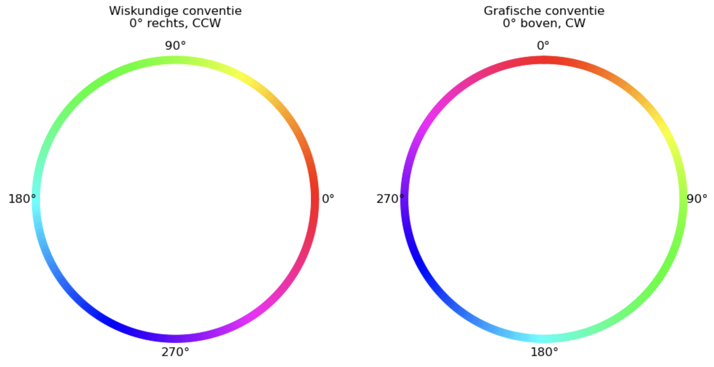
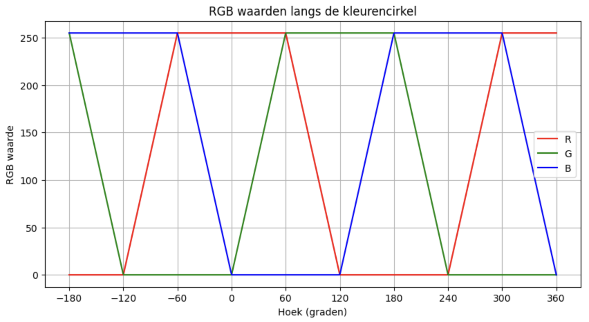

# Kleurtoon (Hue)
## Wat is Hue (Kleurtoon)?

Elke kleur die we zien kun je op verschillende manieren beschrijven.
Er bestaan verschillende kleurmodellen. De twee belangrijkste voor ons zijn:

### RGB-model

- Beschrijft een kleur door te zeggen hoeveel Rood (R), Groen (G) en Blauw (B) er aanwezig is, bijvoorbeeld: felrood = (255, 0, 0), geel = (255, 255, 0).
- Dit model wordt gebruikt door schermen, sensoren, RGB-leds en digitale camera’s.
Hier komen we later uitgebreider op terug, want onze kleursensor meet in RGB.

### HSV/HSL-model

- Beschrijft een kleur door drie eigenschappen:
    - Hue (kleurtoon) → welke kleur (rood, groen, blauw, …)
    - Saturation (verzadiging) → hoe fel of hoe grijsachtig
    - Value (of Lightness) → hoe licht of hoe donker

## Hue: de kleurtoon

De **Hue** is eigenlijk de positie van een kleur op een **kleurencirkel**.

0° = rood
120° = groen
240° = blauw
en zo gaat het verder in een cirkel, net zoals bij de regenboog 🌈
Hue wordt dus gemeten in graden van 0 tot 360.

###Twee conventies

Let op: er bestaan **twee manieren** om die graden op de cirkel te tekenen:

- Wiskundige conventie

    - 0° ligt rechts
    - graden nemen toe tegen de klok in

-Grafische conventie

    - 0° ligt bovenaan, in het "Noorden"
    - graden nemen toe met de klok mee
    - dit is de conventie die de meeste computerprogramma’s gebruiken (zoals HTML, Photoshop, enz.)

## Waarom is dit belangrijk?

Onze kleursensor meet in RGB en geeft waarden terug voor rood, groen, blauw én een totaallichtwaarde (C).
Om die gegevens te kunnen gebruiken om kleuren te herkennen,
moeten we de waarden omzetten naar Hue (en later ook Saturation en Value).

Als je niet weet welke conventie je gebruikt, kan de hoek (en dus de kleurtoon) verkeerd geïnterpreteerd worden.

## Samenvatting

- RGB-model → gebaseerd op hoeveel rood, groen en blauw een kleur bevat.
- HSV-model → gebaseerd op kleurtoon, verzadiging en helderheid.
- Hue = de hoek op de kleurencirkel die de kleur bepaalt.
- Het getal gaat van 0° tot 360°.
- Afhankelijk van de conventie begint rood rechts of bovenaan.

