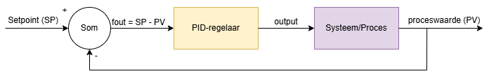

# Introductie tot PID-regelaars

Een PID-regelaar is een veelgebruikte techniek om systemen automatisch te sturen. Denk aan een thermostaat die een kamer op temperatuur houdt, een cruise control in een auto, of een robot die een lijn volgt. PID staat voor **Proportioneel**, **Integrerend** en **Differentiërend**.

## Waarom een regelkring?
Een regelkring zorgt ervoor dat een systeem zich aanpast als er iets verandert. Bijvoorbeeld: als de temperatuur daalt, zal de verwarming harder werken. Zo blijft het systeem stabiel en dicht bij de gewenste waarde (de **setpoint**).

## De drie delen van PID
Een PID-regelaar bestaat uit drie onderdelen die samenwerken:

- **P (Proportioneel):**
  - Reageert direct op de fout (het verschil tussen de gewenste waarde en de gemeten waarde).
  - Hoe groter de fout, hoe sterker de reactie.
  - Praktisch: als je P te hoog zet, reageert het systeem snel, maar kan het gaan schommelen.

- **I (Integrerend):**
  - Kijkt naar de opgetelde fout over tijd (hoe lang en hoe groot was de fout?).
  - Helpt om blijvende afwijkingen weg te werken.
  - Praktisch: als je I te hoog zet, kan het systeem traag worden of gaan overcompenseren.

- **D (Differentiërend):**
  - Reageert op hoe snel de fout verandert (de snelheid van de verandering).
  - Helpt om schommelingen te dempen.
  - Praktisch: als je D te hoog zet, kan het systeem onrustig worden door ruis.

## Wiskundige uitwerking
De PID-regelaar berekent de **output** als volgt:

$$
\text{output} = K_p \cdot e(t) + K_i \cdot \int e(t) dt + K_d \cdot \frac{de(t)}{dt}
$$

- $e(t)$ is de fout op tijdstip $t$.
- $K_p$, $K_i$, $K_d$ zijn de versterkingsfactoren voor elk deel.

## Praktisch voorbeeld
Stel je regelt de temperatuur in een kamer:
- **P** zorgt dat de verwarming harder werkt als het kouder is dan gewenst.
- **I** zorgt dat het systeem ook kleine, blijvende afwijkingen corrigeert.
- **D** zorgt dat het systeem anticipeert op snelle veranderingen en overshoot beperkt.

## Waarom is afstellen belangrijk?
De juiste waarden voor $K_p$, $K_i$ en $K_d$ zorgen dat het systeem snel en stabiel reageert. Te hoge of te lage waarden kunnen zorgen voor schommelen, traagheid of instabiliteit.

## Schematische voorstelling van een PID-regelkring

Hieronder zie je een eenvoudige blokdiagram van een regelkring met PID-regelaar:

**Blokken:**

- **Som** (*Vergelijker*)**:** Berekent de fout '*e*': verschil tussen setpoint en gemeten waarde (PV = Process Value).
- **PID-regelaar:** Bepaalt op basis van de fout hoe het systeem moet worden bijgestuurd.
- **Systeem/Proces:** Het te regelen systeem (bv. verwarming, motor).

**Signalen:**
- **Setpoint (SP):** De gewenste waarde die je wilt bereiken (bv. temperatuur).
- **Fout:** Het verschil tussen gewenste en gemeten waarde.
- **Output:** Het signaal waarmee de PID-regelaar het systeem aanstuurt.
- **Proceswaarde:** De (gemeten) waarde wordt teruggestuurd naar de vergelijker. Dit terug sturen noemen we **terugkoppeling (Feedback)**.

> Het is mogelijk dat er een **sensor** de actuele waarde (proceswaarde) van het systeem moet meten.
